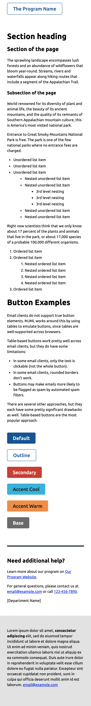
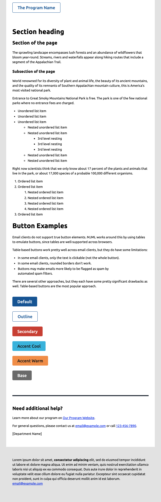

This repo re-creates the [USWDS styles](https://designsystem.digital.gov/) in a way that works with emails.

## Why?

Email clients don't render content in the same way that web browsers do. There is a limited set of CSS styles that will render in each email client. An email that looks great in GMail might look very strange in Yahoo Mail or Outlook (or vice versa!)

When developing code to use in email templates, you should make sure it works across email clients.

## Email Examples

Email example on mobile


Email example on desktop


## How to author effective email templates

Three tips for writing effective emails:

1. Start with a **standard base template** that is designed with accessibility and cross-browser support in mind (this repo).
2. When developing additional styles, make sure to consider **which styles are widely-supported across email clients**, such as referencing the [CanIEmail](https://caniemail.com) project.
3. **Test your emails** across email clients, using a tool such as Email on Acid.

## This project: Two Layers

There are two layers:

1. Basic css that works across email clients (we use this approach as much as possible)
2. For some elements, like buttons, it is difficult to get those to work without additional support. There are tools for this such as [MJML](https://mjml.io/).

### Base CSS

Most of the CSS for USWDS-styled emails can be achieved by including some CSS. This "base CSS" is the foundation of the OGDS Email Templates.

Features:

- The base CSS includes typography defaults for text, headings, and lists, that match the [USWDS Prose element](https://designsystem.digital.gov/components/prose/).
- We recommend leaving the font family as the default one for the email client (do not override this), for two reasons:
  - The default font respects font sizing settings on iOS; custom fonts do not
  - Plain text emails generally perform better than overly-styled emails

Two reference files:

1. The styles are in the `styles.css` file.
2. An example email is in the `template.html` file.

### MJML (etc)

Some "advanced" items, such as buttons, cannot be styled with CSS alone. These depend on the HTML nodes being structured in a certain way. For example, the `<button>` element is widely unsupported in email clients. There are several workarounds to get buttons to work, such as "tables in tables" approach, and the "not-exactly-SVG" approach.

If you need these advanced fetures, MJML is one library that you might use to keep that complexity out of your email templates. Tools like MJML provide an abstraction layer over the complex markup we need to ensure cross-email-client compatibility.

You can find this in the `template.mjml` file.

MJML enables a few specific things that aren't possible with vanilla CSS alone:

- Styling buttons that work across email clients
- Creating something that behaves as an `<hr>` element that works across email clients
- Support for a multi-column layout (not shown)

#### Running MJML Locally

To get this running locally, so you can test it:

1. Install [the MJML App](https://mjmlio.github.io/mjml-app/)
2. Download this Gist
3. Open the folder for this Gist in the MJML App

#### Running MJML Online

1. Open [the MJML online editor](https://mjml.io/try-it-live)
2. Copy-paste in the `.mjml` file below into the web editor.
3. Copy-paste the `.css` contents below into the same file, in the `mj-head`. Like this:

```
<mjml>
  <mj-head>
    <mj-style inline="inline">
      PASTE HERE
    </mj-style>
  </mj-head>
</mjml>
```

## Other Inspiration

I've also taken some inspiration from:

- https://caniemail.com
- https://www.goodemailcode.com/
  - In particular, the base vanilla HTML template is largely from this source.
- https://reallygoodemails.com/
- New Jersey Unemployment Insurance email templates: https://www.figma.com/community/file/1242850667740493704

## Ideas for Improvement

- I think there are better ways we could pull out the typography CSS - I just grabbed the ones I thought were most important, manually.
- We could potentially use more components, like `alert` and others. [New Jersey Unemployment Insurance has some great examples](https://www.figma.com/community/file/1242850667740493704).
- We could make [MJML components](https://documentation.mjml.io/#community-components) for some of these. I'm not sure we need to - the css/`mj-class` approach is pretty good already! I think custom components are more important if there is DOM re-writing (like buttons -> tables).
